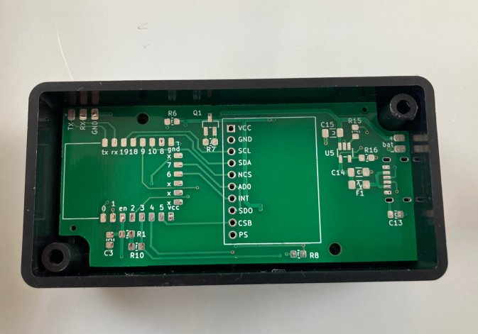

# VhARIO-ESPC3

The 'h' is silent, but the vario speaks ...

Kicad schematic and layout for ESP32-C3 + MPU9250 + MS5611 Bluetooth audio vario.

2-layer PCB sized for [Hammond 1551K 80x40x20 mm enclosure.](docs/1551K.pdf)

All SMD passive components use Kicad hand-solderable footprints.

[PDF Schematic](espc3-vario-schematic.pdf)

## Top

## Bottom

## PCBA from JLCPCB

Only SMD parts on bottom layer in JLCPCB `Basic Parts` library were populated for cost reasons. 

## Hardware

* AI-Thinker  ESP-C3 12F module (C3FN4)
* CJMCU-117 IMU module (MPU9250 + MS5611)
* 74HC240 used as push-pull piezo driver
* USB-C Li-Poly battery charging @ 500mA max with MCP73871
* Soft-switched power on/off

You can find the firmware [here](https://github.com/har-in-air/ESP32C3_BLUETOOTH_AUDIO_VARIO).

# Credits

Prototype design, component sourcing and PCB assembly in collaboration with Benoit Arnal.
 