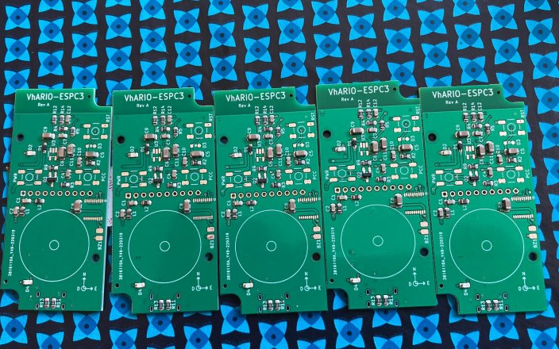
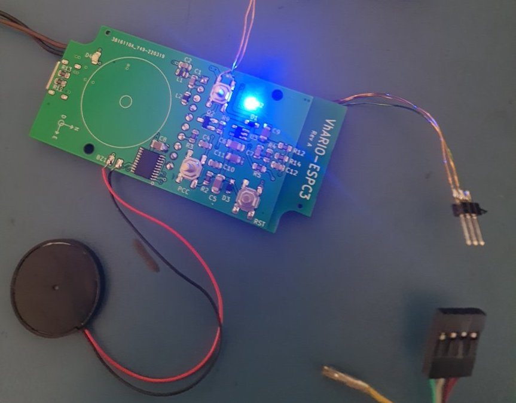
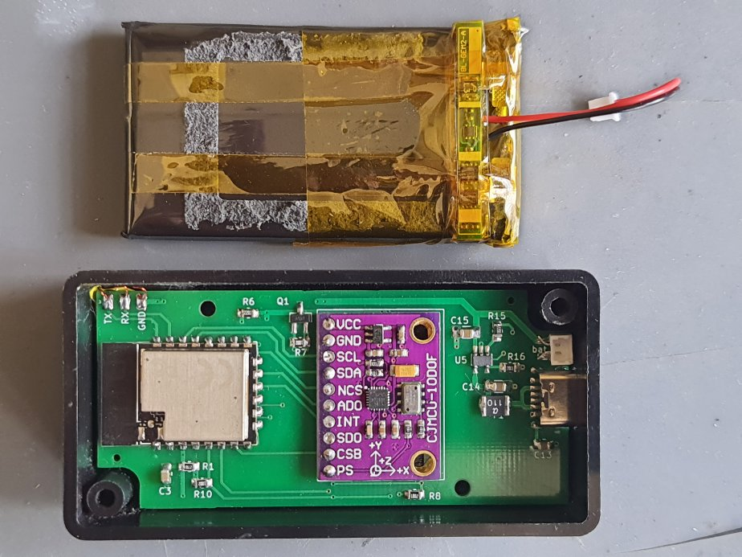
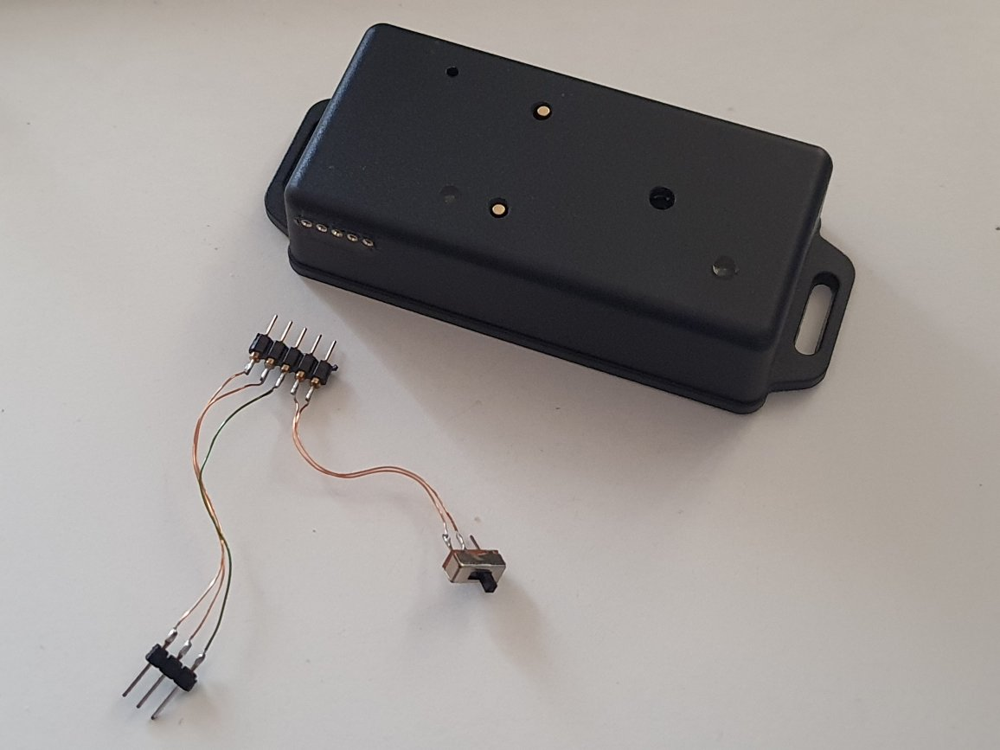

# VhARIO-ESPC3

The 'h' is silent, but the vario speaks ...

Kicad schematic and layout for ESP32-C3 + MPU9250 + MS5611 audio vario. Configured via Wi-Fi web page. Optional Bluetooth transmission of $LK8EX1 sentences for use with apps like [XCTrack](https://xctrack.org).

2-layer PCB sized for [Hammond 1551K 80x40x20 mm enclosure.](docs/1551K.pdf)

All SMD passive components use Kicad hand-solderable footprints.

[PDF Schematic](espc3-vario-schematic.pdf)

You can find the firmware [here](https://github.com/har-in-air/ESP32C3_BLUETOOTH_AUDIO_VARIO).

## Hardware

* AI-Thinker  ESP-C3 12F module (C3FN4).
* CJMCU-117 IMU module (MPU9250 + MS5611).
* 74HC240 used as push-pull piezo driver.
* 1800mAH Li-Poly battery.
* MCP73871 battery charger @ 500mA max, via USB-C connector.
* Soft-switched power on/off.
* "No activity" timeout power-off.

## PCB Top

## PCB Bottom

## PCB Assembly by JLCPCB

For cost reasons, only SMD parts on bottom layer in JLCPCB "Basic Parts" library were selected for automated PCB assembly.

## Bringup

## Final Assembly

## Completed Vario with debug/flash port and connector

# Credits

Prototype design, component sourcing and PCB assembly in collaboration with Benoit Arnal.
 