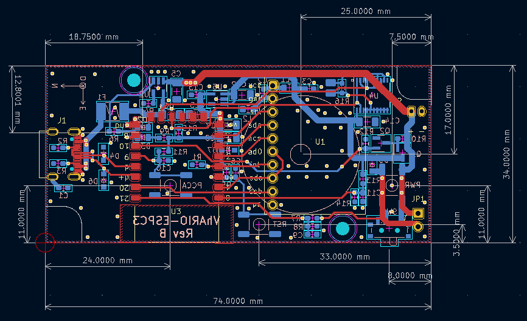

# VhARIO-ESPC3 Rev B

Kicad 6 circuit schematic and PCB layout for an audio variometer using ESP32-C3 and CJMCU-117 IMU modules. The vario uses a Kalman filter to fuse acceleration data and pressure altitude data for 'zero-lag' response. You can find the [firmware project here](https://github.com/har-in-air/ESP32C3_BLUETOOTH_AUDIO_VARIO).

2-layer PCB sized for [Hammond 1551K 80x40x20 mm enclosure](docs/1551K.pdf).

Li-poly battery recharging via USB-C.

ESP32-C3 flash and debug via built-in USB serial jtag peripheral.

All SMD passive components use Kicad hand-solderable footprints.

All component symbols and footprints used in the project are in project-specific libraries in the `/libraries` folder.

## Hardware

* AI-Thinker  ESP-C3 12F module (C3FN4) with 4MByte flash.
* CJMCU-117 IMU module (MPU9250 + MS5611).
* 74HC240 used as push-pull piezo speaker driver.
* 1800mAH Li-Poly battery.
* MCP73871 battery charger @ 500mA max.
* Soft-switched power on/off via SW3.
* USB serial jtag programming and debug via USB-C interface. The flash/debug jumper can be a PCM12 slide switch (SW2) on the bottom layer if you want access from outside the enclosure. Or you can solder a 2.54mm pitch header with a jumper cap (JP1) on the top layer. The jumper is shorted only for flash/debug and is open for normal vario operation.

## Schematic
[Schematic PDF](docs/vhario-espc3-schematic.pdf)

## Differences between Rev A and Rev B hardware
* The Rev A archive can be found in the releases section.
* Rev B is a Kicad 6 project (6.0.6 as of date). Rev A was unfortunately developed with the Kicad 6.99 development branch. This is incompatible with the Kicad 6 project file format. The Rev A project can only be opened with a Kicad 6.99 development build from 2022 Jan 26 or later.
* Flash and debug in Rev B uses the ESP32-C3 built-in USB serial jtag peripheral with a jumper or slide switch (JP1/SW2). For Rev A hardware, an external USB-UART adapter and jumper/switch is required. 
* For Rev B, all smd components except for a couple of modules have been placed on one side of the PCB to facilitate automated assembly.
* For Rev B, the power/bluetooth LED and charging status LED are placed together so only one enclosure LED window is required.
* The [firmware](https://github.com/har-in-air/ESP32C3_BLUETOOTH_AUDIO_VARIO) can be configured to support either Rev A or Rev B hardware. The configuration options are in the `platformio.ini` file.

## PCB Top

## PCB Bottom

# Credits

Prototype design, component sourcing and PCB assembly in collaboration with Benoit Arnal.
 